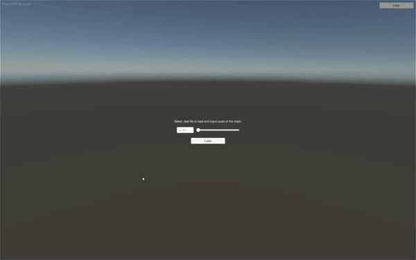

# UnityMeshImportExample

Runtime mesh (.dae file) importer for Unity based on AssimpNet.

## What is Assimp? 

> Open Asset Import Library (Assimp) is a cross-platform 3D model import library which aims to provide a common application programming interface (API) for different 3D asset file formats. 
> Written in C++, it offers interfaces for both C and C++. 
> Bindings to other languages (e.g., BlitzMax, C#, Python) are developed as part of the project or are available elsewhere.
> 
> By Wikipedia
  
In this project we use C# .NET wrapper for the Assimp, [AssimpNet](https://bitbucket.org/Starnick/assimpnet/src/master/)
  
## Quick start with Example



## Getting Started

```cs
string meshFile = <YOUR-DAE-FILE-PATH>;
var ob = MeshImporter.Load(meshFile);
```

## Dependencies

The followings are already included in the project. 

- [SimpleFileBrowser](https://assetstore.unity.com/packages/tools/gui/runtime-file-browser-113006)
- [AssimpNet](https://bitbucket.org/Starnick/assimpnet/src)